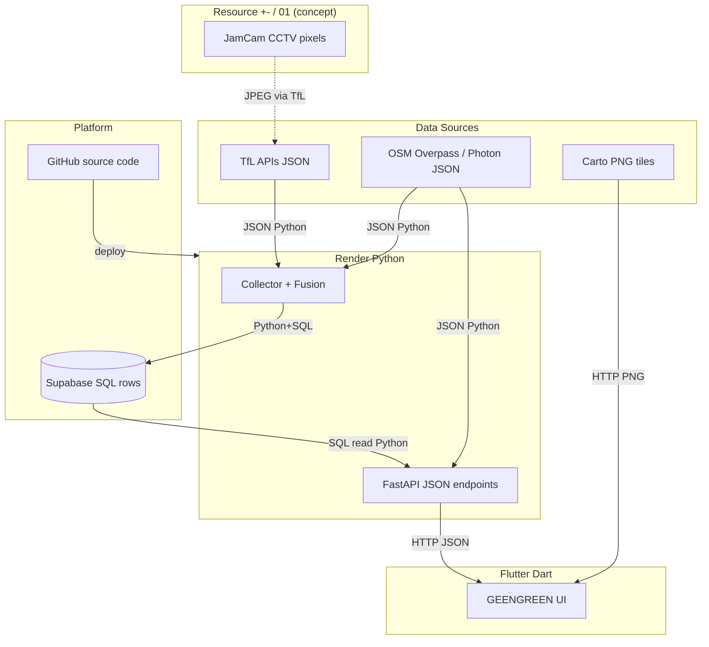

# P1 GEENGREEN — Information Transformation Map

> 목적: **어떤 정보가 어떤 Form으로 변환되는지** 단계별로 도식화  
> 기준: 실제 코드 (`P1_2026` + `london_runner`) · 2026-06

---

## 0. 범례 (도식에 붙일 라벨 규칙)

```
[Form_in] ──Language──▶ [Form_out]
```

| 기호 | 의미 |
|------|------|
| **Form** | 데이터가 저장·전송되는 **형식** (JSON, SQL row, PNG, JPEG, …) |
| **Language** | 그 Form을 **읽고·쓰는** 코드 (Python, SQL, Dart) |
| **+- / 01** | 물리 계층 개념 (CCTV·CPU가 영상을 0/1로 저장) — P1 코드 밖 |

**Form 예:** JSON · YAML · XML · GeoJSON · SQL row · PNG · JPEG · Dart Map · Python dict  
**Language 예:** Python · SQL · Dart · (웹 빌드 시 JS는 Flutter 엔진이 생성, 직접 작성 X)

---

## 1. 전체 레이아웃 (당신 도식 5열 구조)

```
┌─────────────┬──────────────┬─────────────────┬──────────────┬─────────────┐
│  RESOURCE   │     DATA     │    PLATFORM     │  PROCESSING  │   OUTPUT    │
│  +- / 01    │   Sources    │ GitHub + Supa   │    Render    │   Flutter   │
│  (개념)     │              │                 │   (Python)   │   (Dart)    │
└─────────────┴──────────────┴─────────────────┴──────────────┴─────────────┘
```

**GitHub ≠ Supabase**

| | GitHub | Supabase |
|--|--------|----------|
| 저장물 | `.py` `.sql` `.dart` **코드** | **런타임 데이터** (관측·패턴) |
| Form | Git 텍스트 | PostgreSQL **SQL rows** |

---

## 2. 메인 파이프라인 A — 신호 학습 (Collector)

당신 도식: **TFL → Expect signal → Supabase → Render**

```
[CCTV +-/01]          (물리 — 도식만, API 밖)
      │
      ▼
┌─────────────────────────────────────────────────────────────────┐
│ DATA: TfL                                                        │
│  • Bus Arrivals     Form: JSON                                   │
│  • JamCam Place     Form: JSON (imageUrl 포함)                   │
│  • Disruption       Form: JSON                                   │
│  • VehiclePositions Form: JSON                                   │
└───────────────────────────┬─────────────────────────────────────┘
                            │  Language: Python (httpx)
                            ▼
┌─────────────────────────────────────────────────────────────────┐
│ TRANSFORM ①  Json → Python dict                                  │
│  Language: Python (ingest/tfl_service.py)                          │
└───────────────────────────┬─────────────────────────────────────┘
                            │
         ┌──────────────────┼──────────────────┐
         ▼                  ▼                  ▼
   [Bus delay]         [JamCam URL]       [Disruption]
   JSON field           JSON → JPEG GET    JSON lat/lon
         │                  │                  │
         │                  ▼                  │
         │            TRANSFORM ②               │
         │            JPEG → numpy(0~255)       │
         │            Language: Python          │
         │            (PIL + NumPy — CV)        │
         │                  │                  │
         └──────────────────┼──────────────────┘
                            ▼
┌─────────────────────────────────────────────────────────────────┐
│ TRANSFORM ③  Fusion → observation dict                           │
│  G bus + V vehicle + N disruption + O OSM + H JamCam(CV)        │
│  Language: Python (ingest/fusion_service.py)                     │
│  Form_out: Python dict (green_probability, wait_sec, …)          │
└───────────────────────────┬─────────────────────────────────────┘
                            │  Language: Python (supabase-py)
                            ▼
┌─────────────────────────────────────────────────────────────────┐
│ PLATFORM: Supabase                                               │
│  Form: SQL rows                                                  │
│  • bus_signal_observations  (raw 관측)                           │
│  • signal_patterns          (시간대별 upsert 요약)               │
│  Language: SQL schema + Python INSERT/UPSERT                     │
└───────────────────────────┬─────────────────────────────────────┘
                            │  (90분마다 collector / API read)
                            ▼
┌─────────────────────────────────────────────────────────────────┐
│ PROCESSING: Render                                               │
│  Green Commute / check-status 가 pattern 읽기                    │
│  Form: SQL row → Python dict → JSON response                   │
│  Language: Python (FastAPI)                                      │
└───────────────────────────┬─────────────────────────────────────┘
                            │  HTTP JSON
                            ▼
┌─────────────────────────────────────────────────────────────────┐
│ OUTPUT: Flutter                                                  │
│  Form: JSON → Dart Map / RouteOption                             │
│  Language: Dart (features/commute/london_runner_api.dart)        │
└─────────────────────────────────────────────────────────────────┘
```

**파란 라벨 (Collector 구간):**  
`JSON → SQL rows / Python + SQL`

---

## 3. 파이프라인 B — OSM (Double check & locate)

당신 도식: **OSM → Supabase / Render**

실제로는 **두 갈래**:

### B-1. 보행 신호 geofence (백엔드 startup)

```
OSM Overpass API
  Form: Overpass QL query → JSON elements
  Language: Python (ingest/osm_crossings.py)
      ▼
  Form: JSON file / memory list (lat, lon, tags)
      ▼
  Render: is_near_traffic_signal() — 버스 정류장 필터
  Language: Python
```

**파란 라벨:** `JSON / Python`

### B-2. 장소 검색 (Gail's 등)

```
User query "gail's"
  Form: plain text
  Language: Dart (TextField)
      ▼ HTTP
Render /geocode/search
  Language: Python
      ▼
Photon API (OSM 기반)
  Form: GeoJSON JSON
      ▼
Render response
  Form: JSON [{ lat, lon, name, label }]
      ▼
Flutter PlaceLocation
  Language: Dart
```

**파란 라벨:** `Text → JSON → Dart / Python + Dart`

---

## 4. 파이프라인 C — Carto (Visualize map)

당신 도식: **Carto → Flutter (주황선, Render bypass)** ✅ 맞음

```
Carto CDN
  Form: PNG tiles  (URL: .../dark_all/{z}/{x}/{y}.png)
  Language: — (정적 파일 서버)
      ▼  HTTP GET (Flutter가 직접)
Flutter flutter_map
  Form: PNG → GPU texture → pixels on screen
  Language: Dart
  Options: Fade OFF, Retina OFF (UI 표시 설정, Form 변환 아님)
```

**파란 라벨:** `PNG / Dart`

---

## 5. 파이프라인 D — Green Commute (GO 버튼)

```
Flutter (출발·도착·시간)
  Form: Dart state → HTTP query string
      ▼
Render GET /routes/green-commute
  Language: Python
      ├─ TfL Journey JSON → waypoints (Python list[dict])
      ├─ Supabase signal_patterns → SQL row → cycle/wait
      ├─ OSM signals_along_path → count
      └─ pace tuning → green_wave_score
      ▼
  Form: JSON { routes: [5 tiers: 100,95,89,83,77%] }
      ▼
Flutter RoutesScreen
  Language: Dart
```

**파란 라벨:** `JSON / Python → Dart`

---

## 6. Assembly / Arm (맥북)

당신 도식의 **Assembly · Arm · +- / 01**

| 위치 | 의미 | Form / Language |
|------|------|-----------------|
| **+- / 01 (왼쪽)** | JamCam CCTV 물리 신호 | 개념 (하드웨어) |
| **Arm** | Mac Apple Silicon에서 **Flutter 앱 실행** | Dart → **ARM64 machine code** |
| **+- / 01 (Assembly 옆)** | CPU가 처리하는 최종 비트 | 개념 |

**주의:** Render(클라우드 Linux) → Flutter(Mac Arm) 사이에 **Form 변환 단계가 Arm을 거치지 않음**.  
네트워크 JSON은 WiFi/HTTPS로 직접 전달.

```
Render (Python, Linux)  ═══ HTTP JSON ═══▶  Flutter (Dart, Mac ARM64)
Carto (PNG)             ═══ HTTP PNG  ═══▶  Flutter (Dart, Mac ARM64)
```

---

## 7. GitHub의 위치 (Platform)

```
Developer edit
  Form: source text (.py, .sql, .dart)
  Language: Python, SQL, Dart
      ▼ git push
GitHub (main branch)
  Form: Git objects (text blobs)
      ▼ Render auto-deploy
Render container
  Language: Python runtime executes code
```

**GitHub에는 TfL 관측 데이터가 저장되지 않음.**

---

## 8. Mermaid — Figma 옆 참고용



---

## 9. Figma / 도식에 붙일 파란 라벨 — 최종판

| 화살표 | Form 변환 | Language |
|--------|-----------|----------|
| Resource → TfL | +- → **JSON + JPEG URL** | (TfL infra) |
| TfL → Supabase | **JSON → SQL rows** | **Python + SQL** |
| OSM → Render | **JSON (GeoJSON)** | **Python** |
| Supabase → Render | **SQL row → JSON** | **Python** |
| Render → Flutter | **JSON** | **Python → Dart** |
| Carto → Flutter | **PNG** | **Dart** |
| GitHub → Render | **source text → container** | **git / Python runtime** |
| JamCam branch | **JPEG → numpy → GREEN/RED** | **Python (CV)** |

---

## 10. 당신 도식에서 고칠 3점

1. **Supabase와 GitHub를 같은 박스로 두지 말 것** — 데이터 vs 코드  
2. **Carto 화살표는 Render 안 거침** — Flutter 직행  
3. **Render → Arm** 은 “언어가 Dart로 바뀐다”가 아니라 **JSON을 Dart가 받음** + Arm은 **실행 CPU**

---

---

## 11. Repo layout — pipeline = folder (2026-06 reorg)

코드 배치가 **정보 흐름(도식 박스)** 와 1:1로 대응되도록 정리함.

### Backend (`files/app/`)

| 도식 파이프라인 | 폴더 | 주요 파일 |
|----------------|------|-----------|
| **A — TfL Collector** | `ingest/` | `tfl_service.py`, `fusion_service.py`, `signal_collector.py`, `vehicle_signal_service.py`, `crowd_signal_service.py` |
| **B-1 — OSM geofence** | `ingest/` | `osm_crossings.py` |
| **B-2 — Photon 검색** | `geocode/` | `search.py` (로직) · `api/geocode.py` (HTTP 라우터) |
| **D — Green Commute / coaching** | `predict/` | `green_wave_service.py`, `route_service.py`, `bus_signal_service.py`, `signal_prediction.py` |
| **HTTP 경계** | `api/` | `routes.py`, `signals.py`, `sessions.py` |

```
app/
├── api/       ← JSON in/out (FastAPI)
├── ingest/    ← Pipeline A + B-1
├── geocode/   ← Pipeline B-2
├── predict/   ← Pipeline D
├── core/      ← config
└── models/
```

> **삭제:** `app/services/` (역할별로 ingest / geocode / predict 로 분리)

### Flutter (`london_runner/lib/`)

| 도식 파이프라인 | 폴더 | 주요 파일 |
|----------------|------|-----------|
| **B-2 — 장소 검색** | `features/search/` | `geocoding_service.dart`, `place_picker_screen.dart` |
| **D — Green Commute (GO)** | `features/commute/` | `london_runner_api.dart`, `setup_screen.dart`, `routes_screen.dart` |
| **C — Carto + Navigate** | `features/navigate/` | `map_layers.dart`, `navigate_ui.dart`, `run_screen.dart` |
| **공통 플랫폼** | `core/` | `theme/`, `utils/`, `services/` (GPS, HR, TTS) |
| **앱 셸** | `app/` | `main_shell.dart` |

```
lib/
├── app/
├── config/
├── core/
└── features/
    ├── search/
    ├── commute/
    ├── navigate/
    └── profile/
```

> **Carto** (`map_layers.dart`)는 Render를 거치지 않고 Flutter가 CDN에서 PNG 타일을 직접 fetch — 도식 C와 동일.

---

*Repo: `gyuen2026/P1_2026` (backend) · `gyuen2026/london_runner` (Flutter)*
